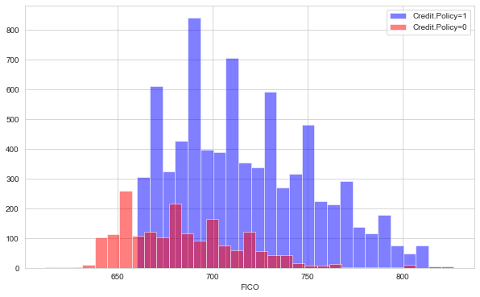
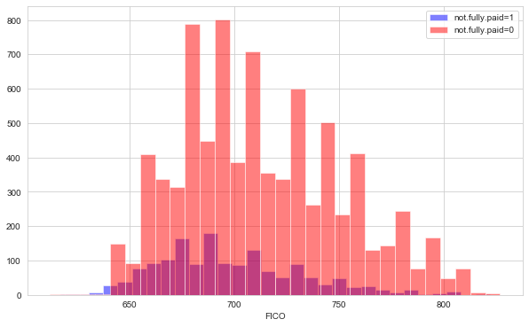
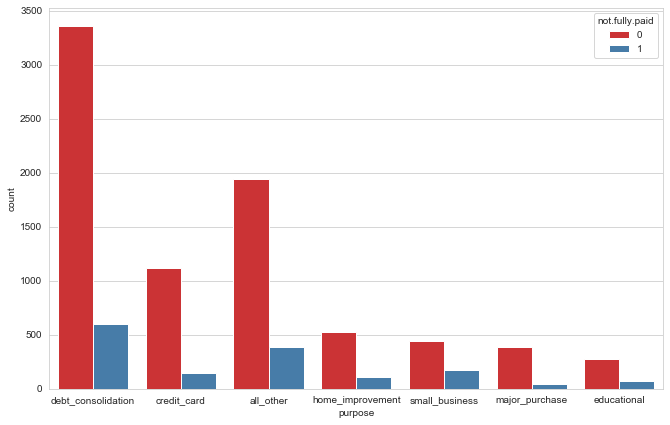
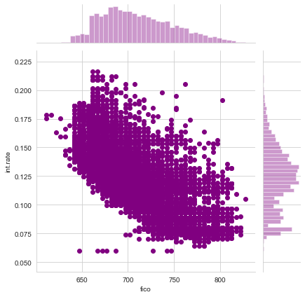
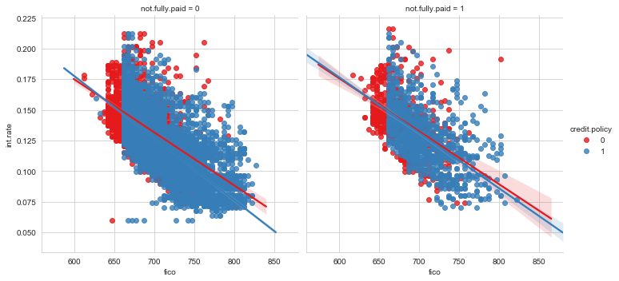

# Random Forest 

data is from LendingClub.com 
Lending Club connects people who need money (borrowers) with people who have money (investors). 
data is from 2007-2010 and be trying to classify and predict whether or not the borrower paid back their loan in full. the data is cleaned of NA values.

Here are what the columns represent:

credit.policy: 1 if the customer meets the credit underwriting criteria of LendingClub.com, and 0 otherwise.
purpose: The purpose of the loan (takes values "credit_card", "debt_consolidation", "educational", "major_purchase", "small_business", and "all_other").
int.rate: The interest rate of the loan, as a proportion (a rate of 11% would be stored as 0.11). Borrowers judged by LendingClub.com to be more risky are assigned higher interest rates.
installment: The monthly installments owed by the borrower if the loan is funded.
log.annual.inc: The natural log of the self-reported annual income of the borrower.
dti: The debt-to-income ratio of the borrower (amount of debt divided by annual income).
fico: The FICO credit score of the borrower.
days.with.cr.line: The number of days the borrower has had a credit line.
revol.bal: The borrower's revolving balance (amount unpaid at the end of the credit card billing cycle).
revol.util: The borrower's revolving line utilization rate (the amount of the credit line used relative to total credit available).
inq.last.6mths: The borrower's number of inquiries by creditors in the last 6 months.
delinq.2yrs: The number of times the borrower had been 30+ days past due on a payment in the past 2 years.
pub.rec: The borrower's number of derogatory public records (bankruptcy filings, tax liens, or judgments).


# Import libraries


```python
import pandas as pd
import numpy as np
import matplotlib.pyplot as plt
import seaborn as sns
%matplotlib inline
```


```python
df = pd.read_csv('loan_data.csv')
```


```python
df.head()
```


<div>
<style scoped>
    .dataframe tbody tr th:only-of-type {
        vertical-align: middle;
    }

    .dataframe tbody tr th {
        vertical-align: top;
    }

    .dataframe thead th {
        text-align: right;
    }
</style>
<table border="1" class="dataframe">
  <thead>
    <tr style="text-align: right;">
      <th></th>
      <th>credit.policy</th>
      <th>purpose</th>
      <th>int.rate</th>
      <th>installment</th>
      <th>log.annual.inc</th>
      <th>dti</th>
      <th>fico</th>
      <th>days.with.cr.line</th>
      <th>revol.bal</th>
      <th>revol.util</th>
      <th>inq.last.6mths</th>
      <th>delinq.2yrs</th>
      <th>pub.rec</th>
      <th>not.fully.paid</th>
    </tr>
  </thead>
  <tbody>
    <tr>
      <td>0</td>
      <td>1</td>
      <td>debt_consolidation</td>
      <td>0.1189</td>
      <td>829.10</td>
      <td>11.350407</td>
      <td>19.48</td>
      <td>737</td>
      <td>5639.958333</td>
      <td>28854</td>
      <td>52.1</td>
      <td>0</td>
      <td>0</td>
      <td>0</td>
      <td>0</td>
    </tr>
    <tr>
      <td>1</td>
      <td>1</td>
      <td>credit_card</td>
      <td>0.1071</td>
      <td>228.22</td>
      <td>11.082143</td>
      <td>14.29</td>
      <td>707</td>
      <td>2760.000000</td>
      <td>33623</td>
      <td>76.7</td>
      <td>0</td>
      <td>0</td>
      <td>0</td>
      <td>0</td>
    </tr>
    <tr>
      <td>2</td>
      <td>1</td>
      <td>debt_consolidation</td>
      <td>0.1357</td>
      <td>366.86</td>
      <td>10.373491</td>
      <td>11.63</td>
      <td>682</td>
      <td>4710.000000</td>
      <td>3511</td>
      <td>25.6</td>
      <td>1</td>
      <td>0</td>
      <td>0</td>
      <td>0</td>
    </tr>
    <tr>
      <td>3</td>
      <td>1</td>
      <td>debt_consolidation</td>
      <td>0.1008</td>
      <td>162.34</td>
      <td>11.350407</td>
      <td>8.10</td>
      <td>712</td>
      <td>2699.958333</td>
      <td>33667</td>
      <td>73.2</td>
      <td>1</td>
      <td>0</td>
      <td>0</td>
      <td>0</td>
    </tr>
    <tr>
      <td>4</td>
      <td>1</td>
      <td>credit_card</td>
      <td>0.1426</td>
      <td>102.92</td>
      <td>11.299732</td>
      <td>14.97</td>
      <td>667</td>
      <td>4066.000000</td>
      <td>4740</td>
      <td>39.5</td>
      <td>0</td>
      <td>1</td>
      <td>0</td>
      <td>0</td>
    </tr>
  </tbody>
</table>
</div>


```python
df.info()
```

    <class 'pandas.core.frame.DataFrame'>
    RangeIndex: 9578 entries, 0 to 9577
    Data columns (total 14 columns):
    credit.policy        9578 non-null int64
    purpose              9578 non-null object
    int.rate             9578 non-null float64
    installment          9578 non-null float64
    log.annual.inc       9578 non-null float64
    dti                  9578 non-null float64
    fico                 9578 non-null int64
    days.with.cr.line    9578 non-null float64
    revol.bal            9578 non-null int64
    revol.util           9578 non-null float64
    inq.last.6mths       9578 non-null int64
    delinq.2yrs          9578 non-null int64
    pub.rec              9578 non-null int64
    not.fully.paid       9578 non-null int64
    dtypes: float64(6), int64(7), object(1)
    memory usage: 1.0+ MB


```python
df.describe()
```


<div>
<style scoped>
    .dataframe tbody tr th:only-of-type {
        vertical-align: middle;
    }

    .dataframe tbody tr th {
        vertical-align: top;
    }

    .dataframe thead th {
        text-align: right;
    }
</style>
<table border="1" class="dataframe">
  <thead>
    <tr style="text-align: right;">
      <th></th>
      <th>credit.policy</th>
      <th>int.rate</th>
      <th>installment</th>
      <th>log.annual.inc</th>
      <th>dti</th>
      <th>fico</th>
      <th>days.with.cr.line</th>
      <th>revol.bal</th>
      <th>revol.util</th>
      <th>inq.last.6mths</th>
      <th>delinq.2yrs</th>
      <th>pub.rec</th>
      <th>not.fully.paid</th>
    </tr>
  </thead>
  <tbody>
    <tr>
      <td>count</td>
      <td>9578.000000</td>
      <td>9578.000000</td>
      <td>9578.000000</td>
      <td>9578.000000</td>
      <td>9578.000000</td>
      <td>9578.000000</td>
      <td>9578.000000</td>
      <td>9.578000e+03</td>
      <td>9578.000000</td>
      <td>9578.000000</td>
      <td>9578.000000</td>
      <td>9578.000000</td>
      <td>9578.000000</td>
    </tr>
    <tr>
      <td>mean</td>
      <td>0.804970</td>
      <td>0.122640</td>
      <td>319.089413</td>
      <td>10.932117</td>
      <td>12.606679</td>
      <td>710.846314</td>
      <td>4560.767197</td>
      <td>1.691396e+04</td>
      <td>46.799236</td>
      <td>1.577469</td>
      <td>0.163708</td>
      <td>0.062122</td>
      <td>0.160054</td>
    </tr>
    <tr>
      <td>std</td>
      <td>0.396245</td>
      <td>0.026847</td>
      <td>207.071301</td>
      <td>0.614813</td>
      <td>6.883970</td>
      <td>37.970537</td>
      <td>2496.930377</td>
      <td>3.375619e+04</td>
      <td>29.014417</td>
      <td>2.200245</td>
      <td>0.546215</td>
      <td>0.262126</td>
      <td>0.366676</td>
    </tr>
    <tr>
      <td>min</td>
      <td>0.000000</td>
      <td>0.060000</td>
      <td>15.670000</td>
      <td>7.547502</td>
      <td>0.000000</td>
      <td>612.000000</td>
      <td>178.958333</td>
      <td>0.000000e+00</td>
      <td>0.000000</td>
      <td>0.000000</td>
      <td>0.000000</td>
      <td>0.000000</td>
      <td>0.000000</td>
    </tr>
    <tr>
      <td>25%</td>
      <td>1.000000</td>
      <td>0.103900</td>
      <td>163.770000</td>
      <td>10.558414</td>
      <td>7.212500</td>
      <td>682.000000</td>
      <td>2820.000000</td>
      <td>3.187000e+03</td>
      <td>22.600000</td>
      <td>0.000000</td>
      <td>0.000000</td>
      <td>0.000000</td>
      <td>0.000000</td>
    </tr>
    <tr>
      <td>50%</td>
      <td>1.000000</td>
      <td>0.122100</td>
      <td>268.950000</td>
      <td>10.928884</td>
      <td>12.665000</td>
      <td>707.000000</td>
      <td>4139.958333</td>
      <td>8.596000e+03</td>
      <td>46.300000</td>
      <td>1.000000</td>
      <td>0.000000</td>
      <td>0.000000</td>
      <td>0.000000</td>
    </tr>
    <tr>
      <td>75%</td>
      <td>1.000000</td>
      <td>0.140700</td>
      <td>432.762500</td>
      <td>11.291293</td>
      <td>17.950000</td>
      <td>737.000000</td>
      <td>5730.000000</td>
      <td>1.824950e+04</td>
      <td>70.900000</td>
      <td>2.000000</td>
      <td>0.000000</td>
      <td>0.000000</td>
      <td>0.000000</td>
    </tr>
    <tr>
      <td>max</td>
      <td>1.000000</td>
      <td>0.216400</td>
      <td>940.140000</td>
      <td>14.528354</td>
      <td>29.960000</td>
      <td>827.000000</td>
      <td>17639.958330</td>
      <td>1.207359e+06</td>
      <td>119.000000</td>
      <td>33.000000</td>
      <td>13.000000</td>
      <td>5.000000</td>
      <td>1.000000</td>
    </tr>
  </tbody>
</table>
</div>


```python

```

# EDA


```python
plt.figure(figsize=(10,6))

df[df['credit.policy'] == 1]['fico'].hist(alpha=0.5, color='blue',
                                         bins=30, label='Credit.Policy=1')
df[df['credit.policy'] == 0]['fico'].hist(alpha=0.5, color='red',
                                         bins=30, label='Credit.Policy=0')
plt.legend()
plt.xlabel('FICO')

```


    Text(0.5, 0, 'FICO')





```python
plt.figure(figsize=(10,6))

df[df['not.fully.paid'] == 1]['fico'].hist(alpha=0.5, color='blue',
                                         bins=30, label='not.fully.paid=1')
df[df['not.fully.paid'] == 0]['fico'].hist(alpha=0.5, color='red',
                                         bins=30, label='not.fully.paid=0')
plt.legend()
plt.xlabel('FICO')

```


    Text(0.5, 0, 'FICO')





```python
plt.figure(figsize=(11,7))
sns.set_style('whitegrid')

sns.countplot(x='purpose',hue='not.fully.paid',data=df,palette='Set1')
```


    <matplotlib.axes._subplots.AxesSubplot at 0x7fbfe20a0f50>





checking the trend between FICO score and interest rate.


```python
sns.jointplot(x='fico',y='int.rate',data=df,color='purple')
```


    <seaborn.axisgrid.JointGrid at 0x7fbfe2236910>





checking if the trend differed between not.fully.paid and credit.policy


```python
plt.figure(figsize=(11,7))
sns.lmplot(y='int.rate',x='fico',data=df,hue='credit.policy',
           col='not.fully.paid',palette='Set1')
```


    <seaborn.axisgrid.FacetGrid at 0x7fbfe1d74dd0>


    <Figure size 792x504 with 0 Axes>





# Getting Data ready for the model

the categorical columns should be transformed for the model in this case column 'purpose' 


```python
cat_feat =['purpose']
```


```python
final_data =pd.get_dummies(df, columns=cat_feat, drop_first=True)
```


```python
final_data.info()
```

    <class 'pandas.core.frame.DataFrame'>
    RangeIndex: 9578 entries, 0 to 9577
    Data columns (total 19 columns):
    credit.policy                 9578 non-null int64
    int.rate                      9578 non-null float64
    installment                   9578 non-null float64
    log.annual.inc                9578 non-null float64
    dti                           9578 non-null float64
    fico                          9578 non-null int64
    days.with.cr.line             9578 non-null float64
    revol.bal                     9578 non-null int64
    revol.util                    9578 non-null float64
    inq.last.6mths                9578 non-null int64
    delinq.2yrs                   9578 non-null int64
    pub.rec                       9578 non-null int64
    not.fully.paid                9578 non-null int64
    purpose_credit_card           9578 non-null uint8
    purpose_debt_consolidation    9578 non-null uint8
    purpose_educational           9578 non-null uint8
    purpose_home_improvement      9578 non-null uint8
    purpose_major_purchase        9578 non-null uint8
    purpose_small_business        9578 non-null uint8
    dtypes: float64(6), int64(7), uint8(6)
    memory usage: 1.0 MB


# Train Test split


```python
from sklearn.model_selection import train_test_split
```


```python

```


```python
X = final_data.drop('not.fully.paid',axis=1)
y = final_data['not.fully.paid']
X_train, X_test, y_train, y_test = train_test_split(X, y, test_size=0.30, random_state=101)
```

## Decision Tree
training a single decision tree


```python
from sklearn.tree import DecisionTreeClassifier
```


```python
dtree = DecisionTreeClassifier()
```


```python
X_train, X_test, y_train, y_test = train_test_split(
     X, y, test_size=0.30)
```


```python
dtree.fit(X_train, y_train)
```


    DecisionTreeClassifier(class_weight=None, criterion='gini', max_depth=None,
                           max_features=None, max_leaf_nodes=None,
                           min_impurity_decrease=0.0, min_impurity_split=None,
                           min_samples_leaf=1, min_samples_split=2,
                           min_weight_fraction_leaf=0.0, presort=False,
                           random_state=None, splitter='best')


```python
predictions = dtree.predict(X_test)
```


```python
from sklearn.metrics import classification_report, confusion_matrix
```


```python
print(classification_report(y_test, predictions))
```

                  precision    recall  f1-score   support
    
               0       0.85      0.82      0.84      2419
               1       0.19      0.22      0.21       455
    
        accuracy                           0.73      2874
       macro avg       0.52      0.52      0.52      2874
    weighted avg       0.75      0.73      0.74      2874
    


```python
print(confusion_matrix(y_test, predictions))
```

    [[1994  425]
     [ 353  102]]


## Random Forest
compare decision tree to random forest


```python
from sklearn.ensemble import RandomForestClassifier
rfc =RandomForestClassifier(n_estimators=600)
rfc.fit(X_train, y_train)
```


    RandomForestClassifier(bootstrap=True, class_weight=None, criterion='gini',
                           max_depth=None, max_features='auto', max_leaf_nodes=None,
                           min_impurity_decrease=0.0, min_impurity_split=None,
                           min_samples_leaf=1, min_samples_split=2,
                           min_weight_fraction_leaf=0.0, n_estimators=600,
                           n_jobs=None, oob_score=False, random_state=None,
                           verbose=0, warm_start=False)


```python
rfc_pred = rfc.predict(X_test)
```


```python
print(classification_report(y_test,rfc_pred))
```

                  precision    recall  f1-score   support
    
               0       0.84      0.99      0.91      2419
               1       0.42      0.03      0.06       455
    
        accuracy                           0.84      2874
       macro avg       0.63      0.51      0.48      2874
    weighted avg       0.78      0.84      0.78      2874
    


Random Forest has predicted better!!


```python

```
